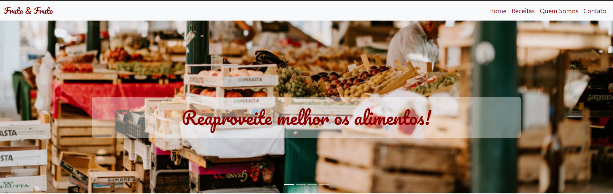
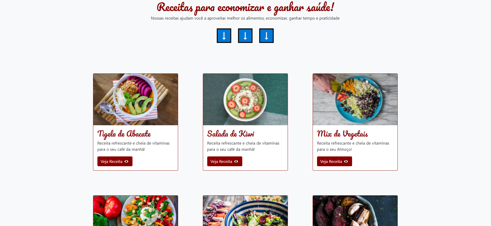
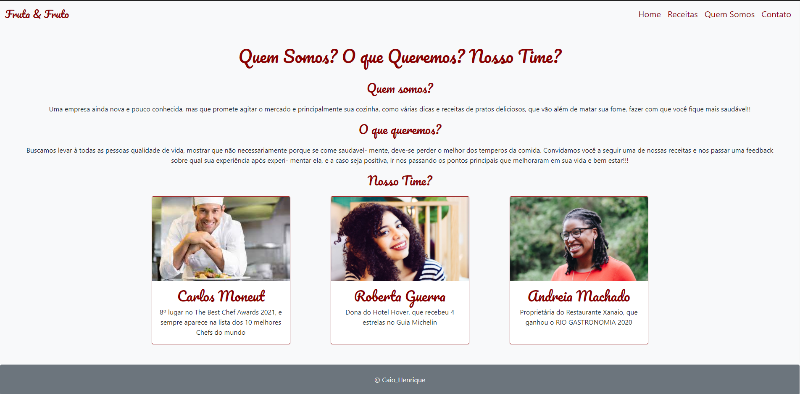

# Alarme ou Timer

## Sobre
Este projeto tem como finalidade desenvolvimento e aprendizado dos conceitos do Frame-
Work Bootstrap.
Nele temos uma simples Landing Page, que tem como produto um portfólio de uma empresa
do ramo alimentício, com receitas onde o objetivo é melhorar a qualidade de vida de 
seus clientes. 
E por último estou aprendender alguns conceitos de uso de Git e o prórpio Git Hub!!
Acesse a aplicação pelo link https://gastronimia.netlify.app/

## Layout
 
 
 

## Tecnologias utilizadas
Foram usadas apenas estruturação e desenvolvimento de linguagens e ferramenetas para Front-End
neste projeto. Elas como já citadas anteriormente são:

 - Bootstrap;
 - HTML;
 - CSS.

## Como contribuir
Se você é um desenvolvedor com mais experiência, sempre tem algumas dicas para dar aos mais novos,
então no que puder acrescentar ao meu trabalho e ao meu crescimento como um desenvolvedor, estarei 
sempre de portas abertas para ouvir aos conselhos e ensinamentos que tiveram para dar!!

## Autor 

 - Caio Henrique Marques da Silva
 - LinkedIn: https://www.linkedin.com/in/caio-henrique-56b713200/
 - Instagram: caiohenrique3
